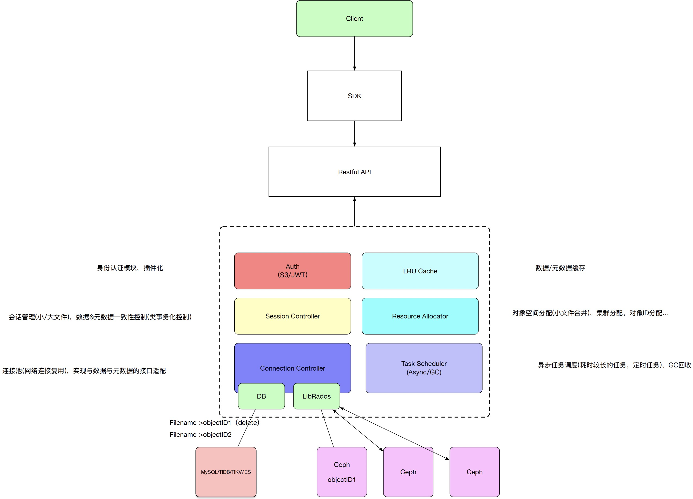

# go-rgw
[English](README.md) | [中文](README_zh.md)  

## Table of contents
- [Introduction](#introduction)
- [Architecture](#architecture)

## Introduction
We need a object storage gateway which is more flexible, lightweight, and adaptable to a wider range of scenarios 
because the RGW of Ceph is difficult to be applicated on a large scale in some enterprise scenarios. Go-rgw is a 
lightweight gateway of ceph based on go-ceph. So far we have implemented some functions: upload, download and 
multipartupload. Also we will add some media functions.  
We store the metadata and acl of the object in the database, like MySQL, ES and so on, and we only store the data of 
object in the ceph, which is convenient to increase the Ceph cluster when we need more space to store data. Also, 
decreasing the number of reads and writes to the Ceph could improve the system performance.

## Architecture

